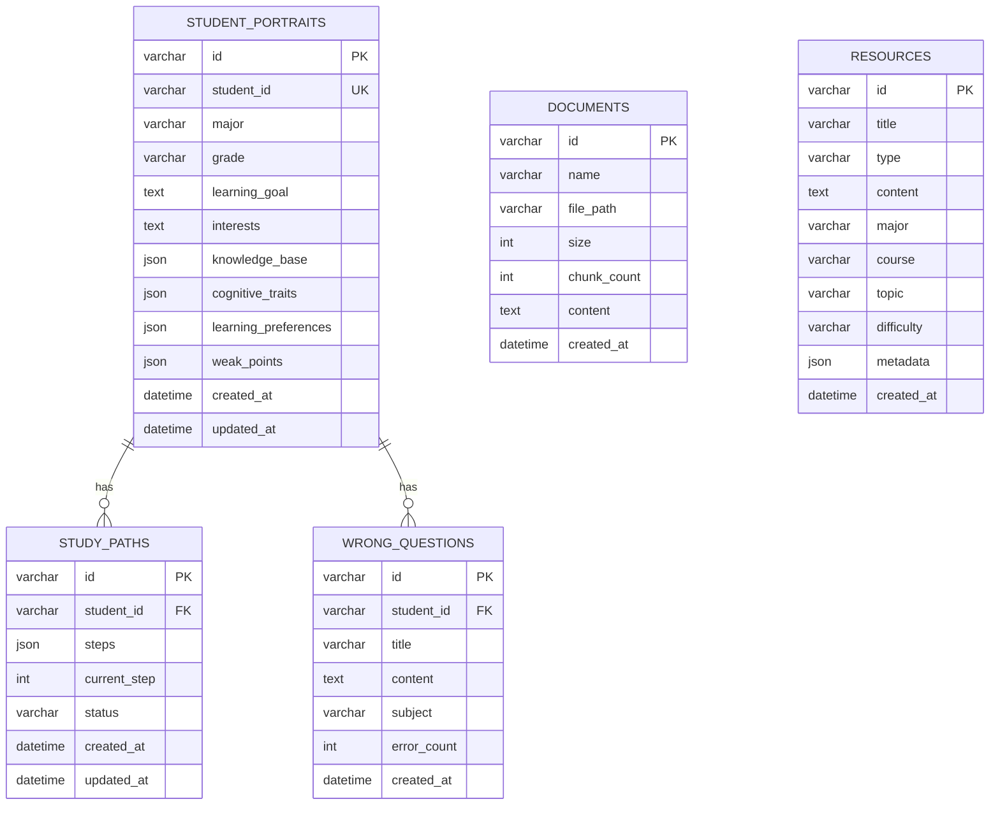

# 数据库设计文档

## 数据库概述

本系统使用 MySQL 数据库，数据库名为 `ai_edu_db`，采用 InnoDB 存储引擎，字符集为 utf8mb4。

## 表结构设计

### 1. student_portraits（学生画像表）

| 字段名 | 类型 | 约束 | 说明 |
| :--- | :--- | :--- | :--- |
| id | VARCHAR(36) | PRIMARY KEY | 主键，UUID |
| student_id | VARCHAR(36) | UNIQUE, NOT NULL | 学生标识 |
| major | VARCHAR(100) | | 专业 |
| grade | VARCHAR(50) | | 年级 |
| learning_goal | TEXT | | 学习目标 |
| interests | TEXT | | 兴趣方向 |
| knowledge_base | JSON | | 知识基础（科目->掌握程度） |
| cognitive_traits | JSON | | 认知风格 |
| learning_preferences | JSON | | 学习偏好 |
| weak_points | JSON | | 易错点 |
| created_at | DATETIME | DEFAULT CURRENT_TIMESTAMP | 创建时间 |
| updated_at | DATETIME | DEFAULT CURRENT_TIMESTAMP ON UPDATE | 更新时间 |

### 2. documents（文档表）

| 字段名 | 类型 | 约束 | 说明 |
| :--- | :--- | :--- | :--- |
| id | VARCHAR(36) | PRIMARY KEY | 主键，UUID |
| name | VARCHAR(255) | NOT NULL | 文档名称 |
| file_path | VARCHAR(500) | NOT NULL | 文件路径 |
| size | INT | NOT NULL | 文件大小（字节） |
| chunk_count | INT | DEFAULT 0 | 切片数量 |
| content | TEXT | | 文档内容 |
| created_at | DATETIME | DEFAULT CURRENT_TIMESTAMP | 创建时间 |

### 3. resources（资源表）

| 字段名 | 类型 | 约束 | 说明 |
| :--- | :--- | :--- | :--- |
| id | VARCHAR(36) | PRIMARY KEY | 主键，UUID |
| title | VARCHAR(255) | NOT NULL | 资源标题 |
| type | VARCHAR(50) | NOT NULL | 资源类型 |
| content | TEXT | | 资源内容 |
| major | VARCHAR(100) | | 专业 |
| course | VARCHAR(200) | | 课程名称 |
| topic | VARCHAR(200) | | 知识点 |
| difficulty | VARCHAR(20) | | 难度级别 |
| metadata | JSON | | 元数据 |
| created_at | DATETIME | DEFAULT CURRENT_TIMESTAMP | 创建时间 |

### 4. study_paths（学习路径表）

| 字段名 | 类型 | 约束 | 说明 |
| :--- | :--- | :--- | :--- |
| id | VARCHAR(36) | PRIMARY KEY | 主键，UUID |
| student_id | VARCHAR(36) | NOT NULL, FOREIGN KEY | 学生标识 |
| steps | JSON | | 学习步骤数组 |
| current_step | INT | DEFAULT 0 | 当前步骤 |
| status | VARCHAR(20) | DEFAULT 'active' | 状态 |
| created_at | DATETIME | DEFAULT CURRENT_TIMESTAMP | 创建时间 |
| updated_at | DATETIME | DEFAULT CURRENT_TIMESTAMP ON UPDATE | 更新时间 |

### 5. wrong_questions（错题本表）

| 字段名 | 类型 | 约束 | 说明 |
| :--- | :--- | :--- | :--- |
| id | VARCHAR(36) | PRIMARY KEY | 主键，UUID |
| student_id | VARCHAR(36) | NOT NULL, FOREIGN KEY | 学生标识 |
| title | VARCHAR(255) | NOT NULL | 题目标题 |
| content | TEXT | | 题目内容 |
| subject | VARCHAR(100) | | 科目 |
| error_count | INT | DEFAULT 1 | 错误次数 |
| created_at | DATETIME | DEFAULT CURRENT_TIMESTAMP | 创建时间 |

## 数据库关系图

## 初始化脚本

数据库初始化脚本位于 `sql/init.sql`，包含创建数据库和所有表的DDL语句。

## 索引设计

| 表名 | 索引名 | 字段 | 类型 |
| :--- | :--- | :--- | :--- |
| student_portraits | idx_student_id | student_id | 普通索引 |
| documents | idx_name | name | 普通索引 |
| resources | idx_type | type | 普通索引 |
| resources | idx_topic | topic | 普通索引 |
| study_paths | idx_student_id | student_id | 普通索引 |
| wrong_questions | idx_student_id | student_id | 普通索引 |

## 数据字典

### 资源类型（resources.type）

| 值 | 说明 |
| :--- | :--- |
| document | 专业课程讲解文档 |
| mindmap | 知识点思维导图 |
| questions | 练习题库 |
| video | 多模态视频 |
| code | 代码实操案例 |
| reading | 拓展阅读材料 |

### 难度级别（resources.difficulty）

| 值 | 说明 |
| :--- | :--- |
| beginner | 入门 |
| basic | 基础 |
| intermediate | 进阶 |
| advanced | 高级 |

### 学习路径状态（study_paths.status）

| 值 | 说明 |
| :--- | :--- |
| active | 进行中 |
| completed | 已完成 |
| paused | 已暂停 |